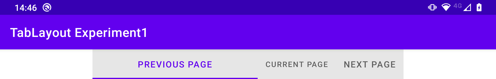

# TabLayout tab width bug

This application demonstrates that a `TabLayout` which has a `tabMode` value of `fixed` and a `tabGravity` value of `fill` results in the first tab having excessive start and end padding on some devices, as follows:

The fix is to give the `TabLayout` a `tabMaxWidth` value different to the default value (as defined by the `design_tab_max_width` dimension value in the `com.google.android.material:material` library) of `264dp`.
I have found that giving the `TabLayout` a `tabMaxWidth` value of `260dp` and a `tabMinWidth` value of `160dp` causes it to render well on all devices in both portrait and landscape orientations, as follows:

