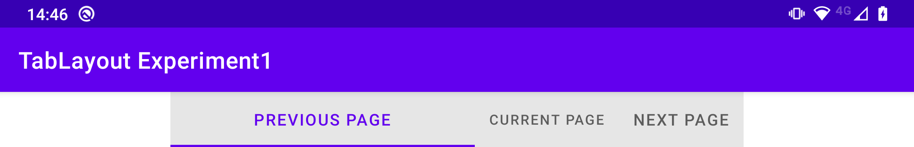

# TabLayout tab width bug

This application demonstrates that a [TabLayout](https://developer.android.com/reference/com/google/android/material/tabs/TabLayout) which has a `tabMode` value of `fixed` and a `tabGravity` value of `fill` (as in the layout file [here](src/main/res/layout/activity_main.xml)) results in the first tab having excessive start and end padding on some devices (e.g. the Moto G8 Plus in landscape orientation), as follows:

The fix (as demonstrated in [app2](../app2)) is to give the `TabLayout` a `tabMaxWidth` value different to the default value of `264dp`.
Note that `TabLayout`s get a default `tabMaxWidth` value via the `Base.Widget.Design.TabLayout` style that's defined in the `com.google.android.material:material` library's `res` folder.
