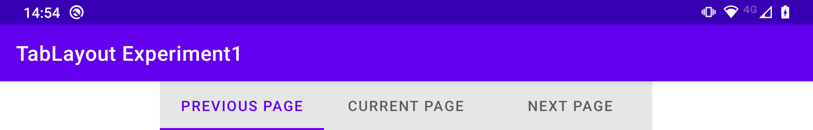

# TabLayout tab width bug workaround

This application demonstrates a workaround for
the [TabLayout](https://developer.android.com/reference/com/google/android/material/tabs/TabLayout) bug which
renders the first tab with excessive start and end padding on some devices.
(See [app1](../app1) for more information about the bug itself.)

I have found that giving the `TabLayout` a `tabMaxWidth` value of `260dp` and a `tabMinWidth` value
of `160dp` (as in the layout file [here](src/main/res/layout/activity_main.xml)) causes it to render well on
all devices in both portrait and landscape orientations, as follows:

